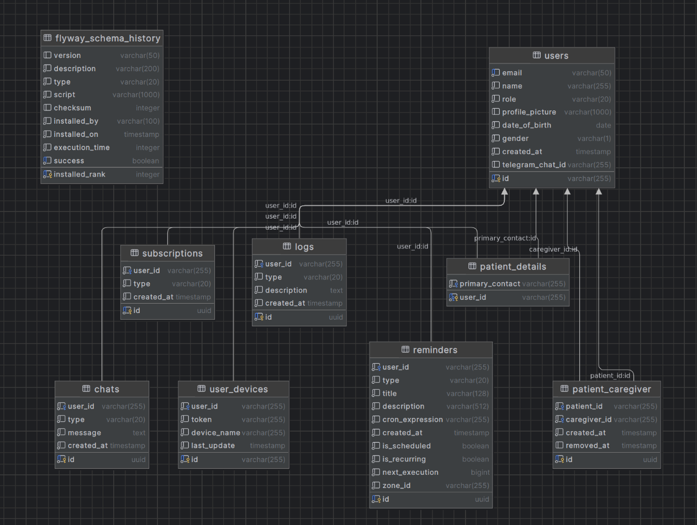
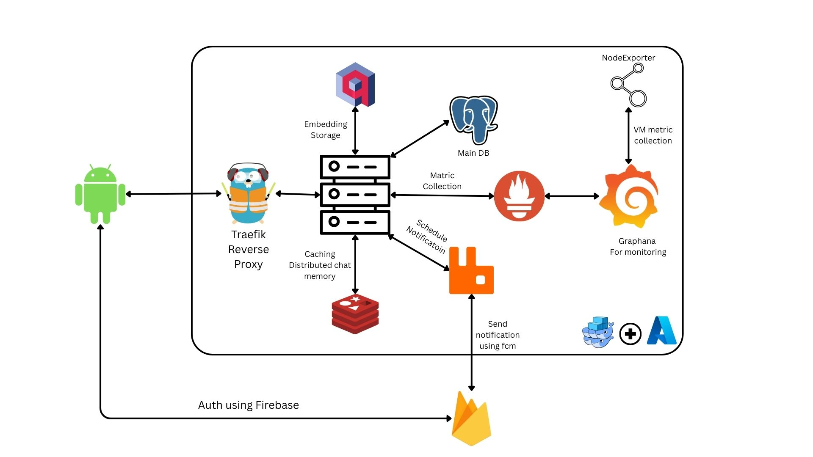
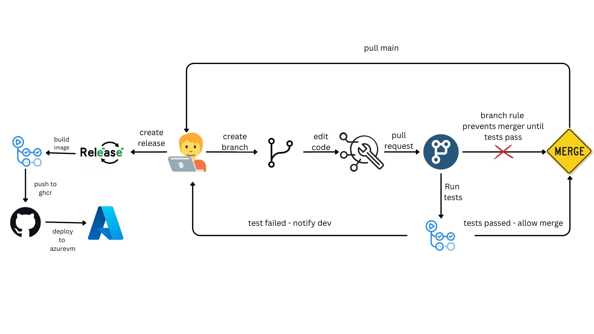

# Software Devolopment Project

**Authors :** Sadatul Islam Sadi, Irtiaz Kabir, Ninad Mahmud Nobo  
**Supervisor:** Sheikh Azizul Hakim, Lecturer, BUET

## Index

- [Introduction](#introduction)
- [Features](#features)
- [Database Schema](#database-schema)
- [Infrastructure Architecture](#infrastructure-architecture)
- [Backend Technologies](#backend-tech)
- [Frontend Technologies](#frontend-tech)
- [Deployment Services](#deployment-services)
- [CI/CD Pipeline](#cicd-pipeline)
- [Challenges & Solutions](#challenges--solutions)
- [License](#license)

## Introduction

In today's fast-paced world, caring for our elderly parents, especially those battling dementia, has become one of the most challenging responsibilities we face. The heart-wrenching reality is that many of us struggle to provide the constant care and attention our loved ones need while juggling work, family, and other life commitments. The guilt of not being there enough, the worry about their safety, and the helplessness of watching them struggle with daily tasks can be overwhelming.

**MindTrace** was born from this very human struggle. We understand that every family dealing with dementia faces unique challenges - the fear of leaving a parent alone, the difficulty in tracking their daily activities, and the constant worry about their well-being. Our solution brings together cutting-edge AI technology with deep empathy for the human experience.

At its core, MindTrace is more than just an app - it's a digital companion that never sleeps, never gets tired, and never forgets. It's the gentle voice that reminds your mother to take her medication, the patient listener who engages your father in meaningful conversations, and the vigilant guardian that captures important moments from their day. But most importantly, it's the bridge that connects you to your loved one's world, even when you can't be physically present.

We believe that technology should serve humanity, not replace it. That's why MindTrace is designed to work seamlessly with your existing care network - whether it's a trusted family member, a professional caregiver, or a dedicated maid. Our multi-layered security ensures that your loved one's privacy and dignity are always protected, while our intelligent notification system keeps everyone who cares informed and connected.

In a world where dementia can make communication difficult and memories fade, MindTrace helps preserve the precious moments, maintain routines, and ensure that no important detail is lost. It's our way of saying that even in the face of cognitive challenges, every life deserves to be lived with dignity, connection, and love.

## Table of Contents
- [Features](#features)
- [Database Schema](#database-schema)
- [Backend Technologies](#backend-tech)
- [Frontend Technologies](#frontend-tech)
- [Deployment Services](#deployment-services)

## Features

### 🤖 AI-Powered Conversational Assistant
- **Intelligent Daily Companion**: Our AI assistant engages patients in meaningful conversations, providing companionship and cognitive stimulation
- **Smart Log Detection**: Automatically identifies and captures important information from conversations, ensuring no crucial details are missed
- **Context-Aware Interactions**: Understands the patient's condition and adapts communication style accordingly

### 👥 Multi-Caregiver Support System
- **Flexible Care Network**: Support for multiple caregivers per patient (family members, professional caregivers, domestic help)
- **Shared Information Access**: All caregivers can view patient logs and important updates in real-time
- **Coordinated Care**: Enables better communication and coordination among all care team members

### 🔐 Advanced Security & Privacy Protection
- **OTP-Based Caregiver Management**: Adding or removing caregivers requires OTP verification sent to the primary contact
- **Primary Contact Verification**: Ensures only authorized family members can approve caregiver changes
- **QR Code Registration**: Secure patient registration through QR scanning with short-lived secrets
- **Telegram Security**: Short-lived UUIDs prevent unauthorized access to notification channels

### ⏰ Smart Reminder System
- **Customizable Reminders**: Caregivers can set medication reminders, appointment alerts, and daily task notifications
- **Flexible Scheduling**: Support for one-time and recurring reminders
- **Reliable Delivery**: Multiple notification channels ensure reminders are never missed

### 📱 Telegram Integration
- **Direct Notifications**: Important updates delivered directly to caregivers and primary contacts via Telegram
- **Separation of Concerns**: Different notification channels for different types of information
- **Real-time Updates**: Instant alerts for critical events and daily summaries

### 🎯 QR-Based Registration & Connection
- **Secure Patient Onboarding**: Patients register by scanning a caregiver's QR code
- **Permission-Based Connection**: QR codes contain short-lived secrets that act as permission tokens
- **Primary Contact Assignment**: Automatic assignment of the scanned caregiver as the patient's primary contact

### 📊 Comprehensive Logging & Monitoring
- **Conversation Logs**: Detailed records of AI-patient interactions
- **Activity Tracking**: Monitor daily patterns and identify potential concerns
- **Caregiver Insights**: Share important information with all authorized caregivers
- **Historical Data**: Maintain long-term records for better care planning

## Database Schema

## Infrastructure Architecture

# Backend Tech

| **Category**        | **Technology**                                                                        |
|---------------------|---------------------------------------------------------------------------------------|
| Main Backend        | Spring Boot 3                                                                         |
| Security            | Spring Security, Spring OAuth Resource Server, Azure Secret Manager, Docker Secret Manager            |
| Database and ORM    | PostgreSQL, Qdrant, Spring Data JPA, Flyway Migrations                                             |
| Caching             | Spring Data Redis                                                                     |
| Mail                | Spring Boot Starter Mail                                                              |
| Tests               | JUnit, Testcontainers                                                                 |
| Notifications       | Firebase Cloud Messaging, RabbitMQ  

## Frontend Tech

| **Category**                    | **Technology**                                                                            |
|---------------------------------|-------------------------------------------------------------------------------------------|
| Main Frontend                   | Kotlin, Android SDK                                                                  

## Deployment Services

| **Component**         | **Technology/Service**                    |
|-----------------------|-------------------------------------------|
| VM              | Azure                                 |
| Contenarization                 | Docker                  |
| Registry               | Github Container Registry                 |
| CI/CD               | Github Actions                 |
| IaC               | Ansible                 |
| Domain                | Namecheap                                 |

### CI/CD Pipeline

## Challenges & Solutions

### 🔄 Chat Memory Scalability Challenge
**Problem**: The default Spring AI chat memory implementation was either in-memory (hindering horizontal scaling) or database-based (too slow for real-time conversations).

**Solution**: We implemented a custom Redis-based chat memory system that provides both high performance and horizontal scalability, ensuring smooth conversational experiences across multiple server instances.

### 📚 Spring AI Learning Curve
**Problem**: Spring AI was released this year with limited external resources and documentation. Most LLM-generated code examples were deprecated or outdated.

**Solution**: We thoroughly studied the official Spring AI documentation and followed best practices to ensure our implementation was up-to-date and production-ready, despite the lack of community resources.

### 🖥️ First-Time VM Deployment
**Problem**: This was our first virtual machine deployment, requiring careful consideration of security aspects like SSH key protection and ensuring reproducible infrastructure.

**Solution**: We implemented comprehensive security measures including SSH key protection and used Ansible for Infrastructure as Code (IaC) to ensure our VM setup is reproducible and maintainable.

### 🔒 Security & Privacy Implementation
**Problem**: Ensuring robust security and privacy for sensitive healthcare data while maintaining usability for elderly users and their caregivers.

**Solution**: We implemented a multi-layered security approach:
- **OTP-based verification** for caregiver management
- **Secret-based QR codes** with short-lived tokens for secure patient registration
- **Telegram integration** with secure UUIDs for notifications
- **Distroless Docker images** to minimize attack surface
- **Minimal attack surface** through careful design of authentication and authorization flows

## License

This project is licensed under the MIT License - see the [LICENSE](LICENSE) file for details.

**MIT License**

Copyright (c) 2024 Sadatul Islam Sadi, Irtiaz Kabir, Ninad Mahmud Nobo

Permission is hereby granted, free of charge, to any person obtaining a copy
of this software and associated documentation files (the "Software"), to deal
in the Software without restriction, including without limitation the rights
to use, copy, modify, merge, publish, distribute, sublicense, and/or sell
copies of the Software, and to permit persons to whom the Software is
furnished to do so, subject to the following conditions:

The above copyright notice and this permission notice shall be included in all
copies or substantial portions of the Software.

THE SOFTWARE IS PROVIDED "AS IS", WITHOUT WARRANTY OF ANY KIND, EXPRESS OR
IMPLIED, INCLUDING BUT NOT LIMITED TO THE WARRANTIES OF MERCHANTABILITY,
FITNESS FOR A PARTICULAR PURPOSE AND NONINFRINGEMENT. IN NO EVENT SHALL THE
AUTHORS OR COPYRIGHT HOLDERS BE LIABLE FOR ANY CLAIM, DAMAGES OR OTHER
LIABILITY, WHETHER IN AN ACTION OF CONTRACT, TORT OR OTHERWISE, ARISING FROM,
OUT OF OR IN CONNECTION WITH THE SOFTWARE OR THE USE OR OTHER DEALINGS IN THE
SOFTWARE.

