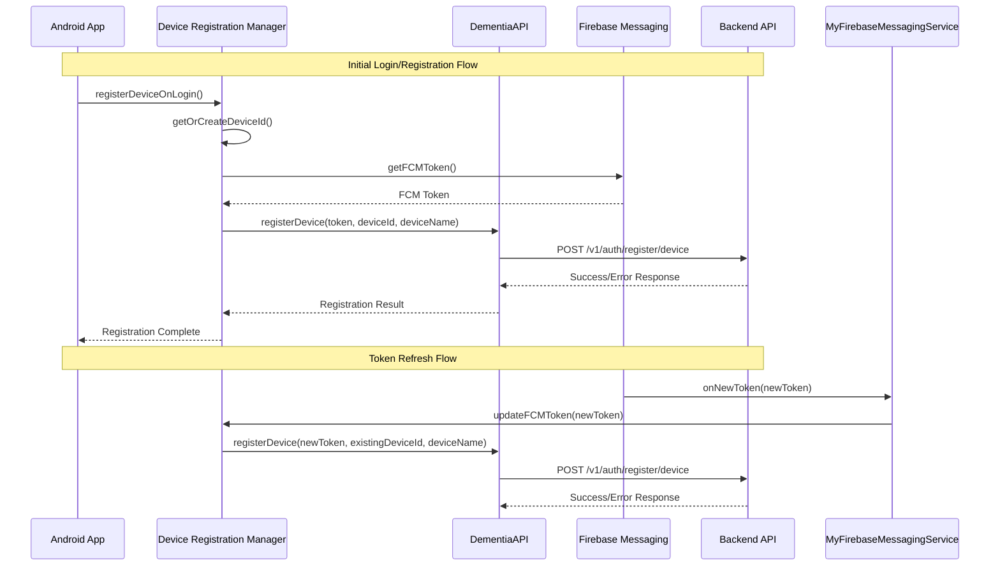

# Design Document

## Overview

This design implements FCM token registration and management for the dementia care Android app. The system will automatically register device FCM tokens with the backend API during user authentication flows and handle token updates when Firebase refreshes them. The design integrates with the existing API architecture and Firebase messaging service.

## Architecture

The FCM token management system consists of three main components:

1. **Device Registration Manager**: Handles device identification and FCM token registration
2. **Enhanced Firebase Messaging Service**: Updates tokens when Firebase refreshes them
3. **API Integration**: Extends existing DementiaAPI with device registration endpoints

### Component Interaction Flow



## Components and Interfaces

### 1. Device Registration Manager

**Purpose**: Centralized management of device identification and FCM token operations.

**Key Responsibilities**:
- Generate and persist unique device IDs
- Create human-readable device names
- Coordinate FCM token registration with backend
- Handle retry logic for failed registrations

**Interface**:
```kotlin
class DeviceRegistrationManager(private val context: Context) {
    suspend fun registerDeviceOnLogin(): Boolean
    suspend fun updateFCMToken(newToken: String): Boolean
    private fun getOrCreateDeviceId(): String
    private fun generateDeviceName(): String
    private suspend fun registerWithBackend(token: String, deviceId: String, deviceName: String): Boolean
}
```

### 2. Enhanced DementiaAPI

**Purpose**: Extend existing API interface with device registration capabilities.

**New Endpoints**:
```kotlin
interface DementiaAPI {
    // Existing endpoints...
    
    @POST("/v1/auth/register/device")
    suspend fun registerDevice(
        @Header("Authorization") bearerToken: String,
        @Body request: DeviceRegistrationRequest
    ): Response<ResponseBody>
}

// Extension functions
suspend fun DementiaAPI.registerDeviceToken(
    token: String, 
    deviceId: String, 
    deviceName: String
): Boolean
```

### 3. Enhanced Firebase Messaging Service

**Purpose**: Handle FCM token updates and trigger backend synchronization.

**Key Changes**:
- Override `onNewToken()` to call device registration manager
- Add proper error handling and logging
- Ensure authentication state before making API calls

## Data Models

### Device Registration Request
```kotlin
data class DeviceRegistrationRequest(
    val token: String,        // FCM token
    val deviceId: String,     // Unique device identifier
    val deviceName: String    // Human-readable device name
)
```

### Device Information Storage
```kotlin
// Stored in SharedPreferences
data class DeviceInfo(
    val deviceId: String,
    val deviceName: String,
    val lastTokenUpdate: Long
)
```

## Error Handling

### Network Errors
- Implement exponential backoff for retry attempts
- Log detailed error information for debugging
- Gracefully handle authentication failures
- Continue app functionality even if registration fails

### Authentication Errors
- Skip token registration if user is not authenticated
- Retry registration on next successful login
- Clear cached device info on sign out

### Firebase Errors
- Handle FCM token retrieval failures
- Log Firebase-specific error codes
- Provide fallback behavior for token unavailability

## Testing Strategy

### Unit Tests
1. **DeviceRegistrationManager Tests**
   - Device ID generation and persistence
   - Device name generation logic
   - API call success/failure scenarios
   - Retry logic validation

2. **API Extension Tests**
   - Device registration endpoint integration
   - Authentication header handling
   - Response parsing and error handling

3. **Firebase Service Tests**
   - Token update handling
   - Authentication state validation
   - Error logging verification

### Integration Tests
1. **End-to-End Registration Flow**
   - Complete login → device registration flow
   - Token refresh → backend update flow
   - Error recovery scenarios

2. **Authentication Integration**
   - Registration during initial login
   - Registration after user registration
   - Behavior when authentication fails

### Manual Testing Scenarios
1. Fresh app install and registration
2. Token refresh simulation
3. Network connectivity issues
4. Backend API unavailability
5. User logout and re-login

## Implementation Considerations

### Device ID Generation
- Use Android's `Settings.Secure.ANDROID_ID` as base
- Combine with app-specific salt for uniqueness
- Store in encrypted SharedPreferences
- Generate new ID only on fresh installs

### Device Name Generation
- Use `Build.MODEL` and `Build.MANUFACTURER`
- Fallback to generic names if unavailable
- Format: "{Manufacturer} {Model}" or "Android Device"

### Retry Strategy
- Maximum 3 retry attempts with exponential backoff
- Initial delay: 1 second, max delay: 30 seconds
- Reset retry count on successful registration

### Performance Optimization
- Cache FCM token to avoid unnecessary Firebase calls
- Batch multiple registration attempts if needed
- Use background threads for all network operations

### Security Considerations
- Encrypt device ID storage
- Validate all API responses
- Handle authentication token expiration
- Sanitize device information before transmission